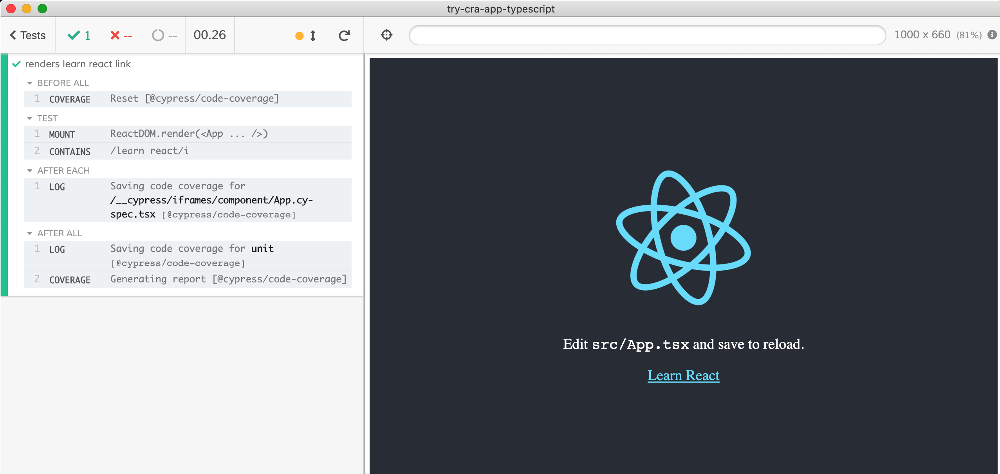
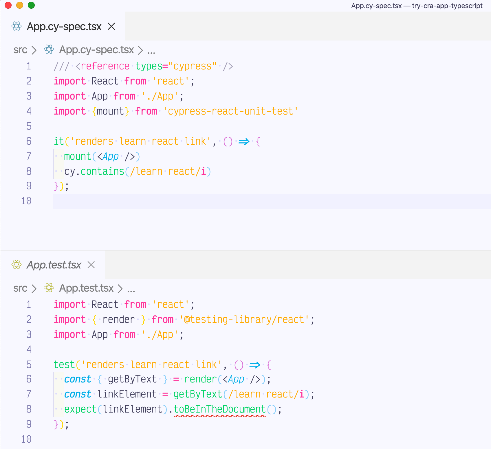
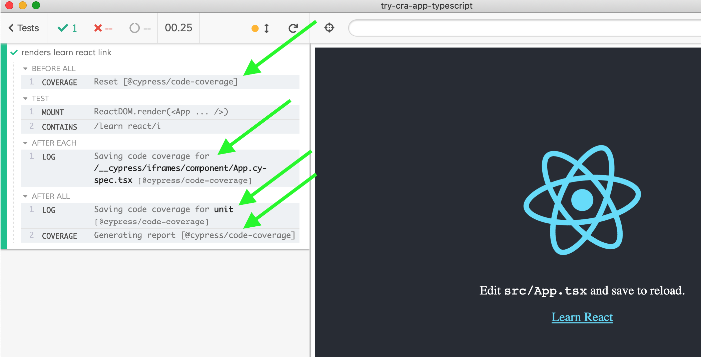

# try-cra-app-typescript [![ci status][ci image]][ci url]  

This project was bootstrapped with [Create React App](https://github.com/facebook/create-react-app) using TypeScript template

```shell
$ npx create-react-app try-cra-app-typescript --template typescript
info Direct dependencies
├─ cra-template-typescript@1.0.3
├─ react-dom@16.13.1
├─ react-scripts@3.4.1
└─ react@16.13.1
```

Then add Cypress and [cypress-react-unit-test](https://github.com/bahmutov/cypress-react-unit-test)

```shell
$ yarn add -D cypress cypress-react-unit-test
info Direct dependencies
├─ cypress-react-unit-test@3.0.1
└─ cypress@4.3.0
```

Create [cypress.json](cypress.json) and point at the unit testing settings: support and plugins to read the create-react-app webpack config and load tests from [src](src) folder.

Create [src/App.cy-spec.tsx](src/App.cy-spec.tsx). Run using `yarn cypress open` and you should see the working component test.



The test vs the original [React Testing Library](https://testing-library.com/docs/react-testing-library/intro) test file (nothing like type clashes between Mocha and Jest assertions, right)



## Code coverage

The component tests collect code coverage automatically. You should see messages in the command log.



When running on CI, the collected coverage information is checked using [check-code-coverage](https://github.com/bahmutov/check-code-coverage) utility. If the code coverage is not being collected, run Cypress with environment variable to see logs:

```
DEBUG=cypress-react-unit-test,find-webpack
```

[ci image]: https://github.com/bahmutov/try-cra-app-typescript/workflows/ci/badge.svg?branch=master
[ci url]: https://github.com/bahmutov/try-cra-app-typescript/actions
